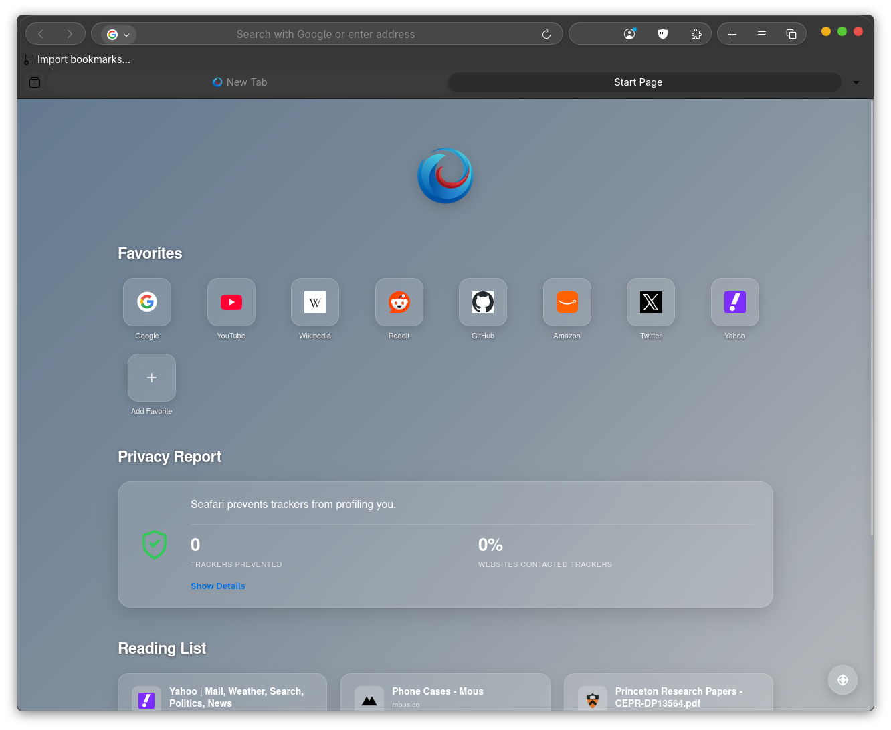

# Seafari

Seafari is a browser made on top of Mozilla Firefox. Gets daily updates from Mozilla source and is fully open-source.  
Seafari replicates the UI and look of Safari, the browser of MacOS.  Seafari is WIP, so expect visual bugs or incoherences.




##  It's different
You're probably wondering why create a new browser when you can start from Gnome's Epiphany browser. The problem is that Epiphany does not support extensions and is blocked by some search engines.  
Seafari is based on a mainstream browser: Mozilla Firefox.  

Firefox is the browser that gives the user the most freedom, with a wide range of extensions that you probably won't find in the Chrome web store.
In addition, Seafari includes uBlock Origin, the original, breaking the record for blocking trackers more than Safari.  

You're probably wondering why one more browser if you can already tune the Firefox UI...
Yes, but Seafari tunes it deeply. We explain it in the next section:

## An innovative way that saves costs and is 100% auditable.  

It all started when I wanted to make my first browser. I tried to tune Brave Browser, but it was impossible without recompiling everything. Until one day I was looking at a typical Firefox page with the image of the fox and I decided to see the html code and where the image of the fox came from. Suddenly, I entered an entire directory containing all the browser settings and assets. When I found out more, I discovered that all of this was inside omni.ja, a kind of zip that packaged the Firefox core and that could be decompressed, modified and recompressed without compiling. It was when I had the idea that everything could be built in an action and that could download the latest version of Firefox every day and automatically compose Seafari.
This way, Seafari is updated at the same time as Firefox. And you can audit how everything is created from the source code to the action code.

## Installation

Seafari is distributed with versions compatible with Debian, Fedora, Arch and their respective AMD and ARM architectures. A generic Appimage is also distributed.

## Development

To build Seafari locally:

1. Clone the repository:
   ```bash
   git clone https://github.com/InledGroup/seafari.git
   cd seafari
   ```
2. Run the build script (requires `dpkg-dev`, `binutils`, and `fpm` for RPM):
   ```bash
   ./build_seafari.sh amd64 --skip-rpm
   ```
`---skip-rpm` is optional, only is you want to generate a .deb and appimage faster.  

3. Clean your system for unwanted old configs **IMPORTANT**
```bash
rm -rf ~/.mozilla/seafari-profile
```
4. Run the Appimage
```bash
./Seafari-x86_64.AppImage
```

## License and acknowledgment

Seafari is distributed under the same terms as Mozilla Firefox.  
The code made by Inled is licensed under [MIT-INLED](https://license.inled.es) 
The base theme is based on [Vinceliuice/MacTahoe GTK Theme](https://github.com/vinceliuice/MacTahoe-gtk-theme/tree/main/other/firefox) (with a lot of changes)  

## Legal  
Seafari is a product of Inled Group, which is not affiliated with Mozilla or Apple.
If you'd like to integrate Seafari into your distribution, we would greatly appreciate it, and it would be even better if you mentioned us.
Feel free to contact us with any questions. We welcome pull requests and issues.

## Contribute!  
Contributions and issues are welcome! You will become a contributor and we will give you appropriate credit for each post. Read more at[https://help.inled.es/help/contribute-to-inled-projects/](https://help.inled.es/help/contribute-to-inled-projects/)

---
v2
