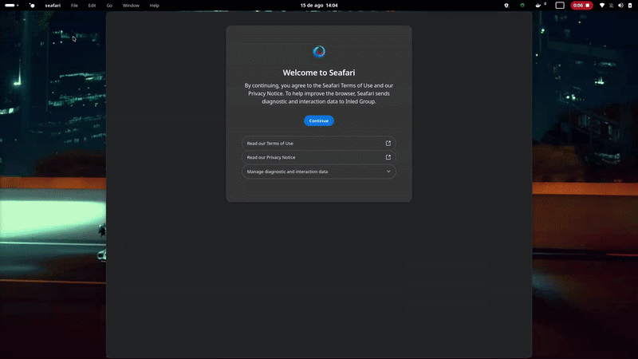
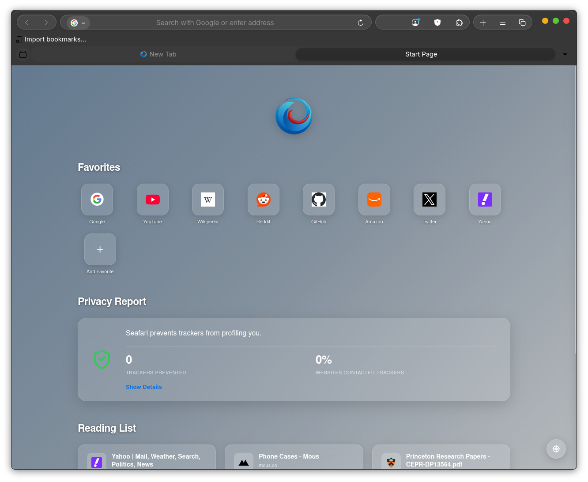

<div align="left">
  
  <h1>Seafari</h1>
</div>

Seafari is a browser made on top of Mozilla Firefox. Gets daily updates from Mozilla source and is fully open-source.  
Seafari replicates the UI and look of Safari, the browser of MacOS.  Seafari is WIP, so expect visual bugs or incoherences.  

**We are proud to announce that Seafari is now the default browser for Pear OS**

<p align="center">
  
</p>

<p align="center">
  
</p>

<p align="center">
  
</p>


##  It's different
You're probably wondering why create a new browser when you can start from Gnome's Epiphany browser. The problem is that Epiphany does not support extensions and is blocked by some search engines.  
Seafari is based on a mainstream browser: Mozilla Firefox.  

Firefox is the browser that gives the user the most freedom, with a wide range of extensions that you probably won't find in the Chrome web store.
In addition, Seafari includes uBlock Origin, the original, breaking the record for blocking trackers more than Safari.  

You're probably wondering why one more browser if you can already tune the Firefox UI...
Yes, but Seafari tunes it deeply. We explain it in the next section:

## An innovative way that saves costs and is 100% auditable.  

It all started when I wanted to make my first browser. I tried to tune Brave Browser, but it was impossible without recompiling everything. Until one day I was looking at a typical Firefox page with the image of the fox and I decided to see the html code and where the image of the fox came from. Suddenly, I entered an entire directory containing all the browser settings and assets. When I found out more, I discovered that all of this was inside omni.ja, a kind of zip that packaged the Firefox core and that could be decompressed, modified and recompressed without compiling. It was when I had the idea that everything could be built in an action and that could download the latest version of Firefox every day and automatically compose Seafari.
This way, Seafari is updated at the same time as Firefox. And you can audit how everything is created from the source code to the action code.

## Installation

Seafari is distributed with versions compatible with Debian, Fedora, Arch and their respective AMD and ARM architectures. A generic Appimage is also distributed.

## Changelog  

### v2.7.*  
- Now the top toolbox is automatically hidden when scrolling a page and reappears in the same way.
- Added support for background videos in NTP
- Correct link handling
### v2.5.*
- New unified pills for button groups, like in Safari
- uBlock Origin button next to the Firefox button
- New Safari-like NewTabPage  

## Daily security updates  
Seafari is updated daily by downloading the latest version of Firefox from Mozilla. That is why a smaller version is published every day. It's not a bug, it's a security feature.

## Development & Building

### Build Dependencies

The build script creates native packages (`.deb`, `.pkg.tar.zst`, `.rpm`) and a portable `.AppImage`. Ensure the required tools are installed:

| Tool | Purpose |
| :--- | :--- |
| `wget` | Download base Firefox archive and extensions |
| `tar` / `xz` | Extraction of the Firefox base package |
| `unzip` / `zip` | Patching uBlock Origin manifest & integration scripts |
| `python3` | Editing extension manifests |
| `dpkg-deb` (`dpkg`) | Building `.deb` Debian/Ubuntu packages |
| `bsdtar` (`libarchive`) | Packaging `.pkg.tar.zst` Arch Linux packages |
| `zstd` | Compressing `.pkg.tar.zst` packages |
| `rpmbuild` (`rpm-tools`) | Building `.rpm` Fedora/openSUSE packages |

#### Installing Dependencies

* **Arch Linux / Pulsar OS / Manjaro:**
  ```bash
  sudo pacman -S --needed wget tar xz unzip zip python dpkg rpm-tools libarchive zstd
  ```

* **Debian / Ubuntu / Linux Mint:**
  ```bash
  sudo apt update && sudo apt install -y wget tar xz-utils unzip zip python3 dpkg-dev rpm libarchive-tools zstd
  ```

* **Fedora / RHEL / AlmaLinux:**
  ```bash
  sudo dnf install -y wget tar xz unzip zip python3 dpkg rpm-build bsdtar zstd
  ```

---

### Building Seafari Locally

1. Clone the repository:
   ```bash
   git clone https://github.com/InledGroup/seafari.git
   cd seafari
   ```

2. Run the build script:
   ```bash
   ./build_seafari.sh --version 2.8.0 --arch amd64
   ```
   * *Optional flags:*
     * `--skip-rpm`: Skip RPM packaging to build faster.
     * `--safari-ua`: Enable Safari user-agent override.

3. Clean your system of unwanted old configs (**IMPORTANT** when testing UI changes):
   ```bash
   rm -rf ~/.mozilla/seafari-profile
   ```

4. Run the generated AppImage:
   ```bash
   ./Seafari-x86_64.AppImage
   ```
## Auto publish system  
Write [RELEASE] on commit for acumulative release.  

## TIPS:  
### Devtools for full UI:  
Go to `about:config` and set to true:
- devtools.chrome.enabled
- devtools.debugger.remote-enabled  
Then, press **Ctrl+Shift+Alt+I**

## License and acknowledgment

Seafari is distributed under the same terms as Mozilla Firefox.  
The code made by Inled is licensed under [MIT-INLED](https://license.inled.es) 
The base theme is based on [Vinceliuice/MacTahoe GTK Theme](https://github.com/vinceliuice/MacTahoe-gtk-theme/tree/main/other/firefox) (with a lot of changes)  

## Legal  
Seafari is a product of Inled Group, which is not affiliated with Mozilla or Apple.
If you'd like to integrate Seafari into your distribution, we would greatly appreciate it, and it would be even better if you mentioned us.
Feel free to contact us with any questions. We welcome pull requests and issues.

## Contribute!  
Contributions and issues are welcome! You will become a contributor and we will give you appropriate credit for each post. Read more at [https://help.inled.es/help/contribute-to-inled-projects/](https://help.inled.es/help/contribute-to-inled-projects/)

---
v2.6
